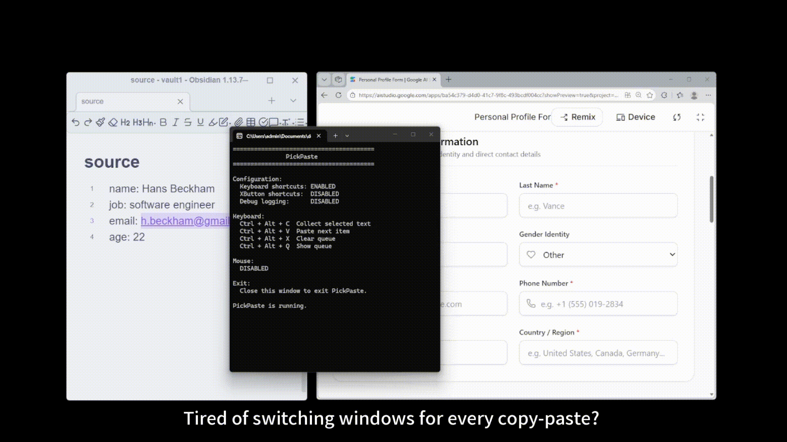

# 🚀 PickPaste — Votre Changement de Jeu Productif

**Ne gaspillez plus de temps en changement de fenêtre. Un clic pour lancer, transformez complètement votre flux de travail.**



- [💭 Notre Philosophie](#-notre-philosophie)
- [⚡ Problème → Solution → Résultats](#-problème--solution--résultats)
- [💡 Ce Que Vous Obtenez](#-ce-que-vous-obtenez)
- [👥 Qui Adore Cela & Comment Ça Aide](#-qui-adore-cela--comment-ça-aide)
- [🚀 Démarrage Rapide (C'est Si Simple)](#-démarrage-rapide-cest-si-simple)
- [❓ FAQ](#-faq)
- [⚖️ Licence](#️-licence)


## 💭 Notre Philosophie

> **Nous ne vous faisons pas travailler plus vite—nous protégeons votre concentration.**

La plupart des outils tentent d'optimiser la vitesse de surface. PickPaste est différent.

Nous protégeons ce qui compte : **votre concentration, votre état de flux, votre satisfaction en complétant le travail.**

Ce n'est pas seulement une économie de temps. **C'est préserver ce qui est le plus précieux dans votre carrière : votre attention.**


## ⚡ Problème → Solution → Résultats

### Le Problème

Chaque jour, des millions de travailleurs répètent le même cycle :

**Trouver info → Changer fenêtre → Entrer info → Changer à nouveau → Répéter 50 fois...**

La recherche montre que **chaque changement de fenêtre prend 15-25 secondes pour récupérer la concentration**. Une tâche qui semble 10 minutes en prend réellement 25——15 gaspillées en changements. Votre attention se fragmente.

### Notre Solution

```
❌ Traditionnel: trouver→changer→entrer | trouver→changer→entrer | trouver→changer→entrer  [flux détruit]
✅ PickPaste: trouver→trouver→trouver | changer une fois | entrer→entrer→entrer  [flux continu]
```

**Logique de base** : Collectez d'abord toutes les informations, puis complétez tout le travail. Pas d'interruptions.

### Résultats

| Métrique | Traditionnel | PickPaste |
|----------|-------------|----------|
| Entrer 10 données | 20+ minutes | 3-4 minutes |
| Changements de fenêtre | 20+ fois | 1 fois |
| Moments de récupération de concentration | 15+ fois | 0 fois |
| Satisfaction du travail | 😫 Épuisé | 😎 Fluide |


## 💡 Ce Que Vous Obtenez

### 💪 Augmentation d'Efficacité 200%+
Pas seulement de la vitesse, mais **protection de votre état de flux**. Le travail devient continu et fluide.

### 🧠 La Charge Cognitive Baisse Dramatiquement
Arrêtez de vous demander « où suis-je ? » et « qu'est-ce qui vient ensuite ? ». Concentrez-vous simplement sur la tâche actuelle.

### 💨 Coût d'Apprentissage Zéro
Installez et utilisez immédiatement. Pas d'interface complexe, pas de courbe d'apprentissage abrupte.

### ⚡ Véritablement Léger
Utilisation mémoire <10MB, complètement hors ligne, zéro suivi.

### 🎯 Philosophie Minimaliste
Fait une chose parfaitement. Pas un « gestionnaire de presse-papiers » bloated.


## 👥 Qui Adore Cela & Comment Ça Aide

### Ventes/Opérations — Extraire des infos de multiples sources
**Traditionnel** : Voir email → copier → ouvrir feuille → coller → retour à l'email (répéter 50+ fois)  
**PickPaste** : Voir tous les emails et les copier → basculer vers feuille → colle continue ✨

### Éditeurs/Journalistes — Organiser la recherche multi-source
**Traditionnel** : Rechercher page web → écrire document → rechercher à nouveau → revenir… flux détruit  
**PickPaste** : Collecter tous les matériaux en premier → basculer vers document → écrire sans interruptions ✨

### Développeurs — Collecter messages d'erreur, extraits de code, paramètres
**Traditionnel** : Vérifier journal → copier → coller dans éditeur → revérifier journal… changements constants  
**PickPaste** : Collecter toutes les infos de multiples sources → basculer vers code → utiliser tout d'un coup ✨

### Analystes de Données — Extraire données de multiples rapports
Économisez 10 minutes de temps de concentration par rapport aux 15 minutes de changement de fenêtre.

### Autres scénarios
- Remplissage de formulaire (champs Web → feuille de calcul)
- Saisie données Excel (travaillez en écoutant de la musique)
- Curation de contenu (PDFs, emails, chats → document)
- Tout travail impliquant « déplacer du texte entre fenêtres »


## Démarrage Rapide

### ✨ Lancement en 1 Seconde

1. **Télécharger** [](https://github.com/pilot-ball/PickPaste/releases/latest)
2. Double-cliquez sur PickPaste.exe pour l'utiliser immédiatement. Aucune installation, configuration ou redémarrage de l'ordinateur n'est nécessaire.

### 🎮 Raccourcis Clavier

| Raccourci | Fonction |
|-----------|----------|
| `Ctrl + Alt + C` | Collecter le presse-papiers |
| `Ctrl + Alt + V` | Coller l'élément suivant |
| `Ctrl + Alt + X` | Effacer la file |
| `Ctrl + Alt + Q` | Afficher l'état de la file |

**Les utilisateurs de souris aussi** : Supporte les boutons latéraux de la souris (XButton1/XButton2) pour les mêmes actions.


### ⚙️ Configuration (Complètement Optionnel)

Assurez-vous que config.ini se trouve dans le même dossier que PickPaste.exe, puis modifiez config.ini :

```ini
[Hotkeys]
EnableKeyboard=true    # Activer les raccourcis clavier Ctrl+Alt+C, Ctrl+Alt+V, Ctrl+Alt+X, Ctrl+Alt+Q
EnableXButton=true     # Activer les boutons latéraux de la souris
```

Pour désactiver les raccourcis clavier ou les boutons latéraux de la souris, utilisez les paramètres suivants :
```ini
[HotKeys]
EnableKeyboard=false # Désactiver les raccourcis clavier Ctrl+Alt+C, Ctrl+Alt+V, Ctrl+Alt+X, Ctrl+Alt+Q
EnableXButton=false # Désactiver les boutons latéraux de la souris
```

Enregistrez le fichier et exécutez à nouveau PickPaste.exe pour que les modifications prennent effet. Aucun redémarrage de l'ordinateur n'est nécessaire.

### Configuration Requise

| Élément | Exigence |
|--------|----------|
| **Système d'Exploitation** | Windows 10 / Windows 11 |
| **PowerShell** | 5.0+ (intégré dans Windows) |
| **Environnement .NET** | .NET Framework 4.x intégré |
| **Niveau de Permission** | Droits utilisateur standard |
| **Réseau** | Non requis |
| **Droits Admin** | Généralement non requis |
| **Dépendances Tierces** | Zéro |
| **Utilisation de la Mémoire** | <10 MB |
| **Utilisation du Disque** | <2 MB |

**Au final** : Vous avez Windows 10 ? PickPaste fonctionne.

## Traditionnel vs PickPaste

| Métrique | Traditionnel | PickPaste |
|----------|-------------|----------|
| Temps pour 10 entrées de données | 20+ minutes | 3-4 minutes |
| Changements de fenêtre | 20+ fois | 1 fois |
| Moments de récupération de concentration | 15+ fois | 0 fois |
| Raison restante | 50% | 95% |
| Satisfaction du travail | 😫 | 😎 |


## FAQ

**Q: Avez-vous besoin de droits d'administrateur ?**  
R: Non. Les permissions d'utilisateur standard suffisent.

**Q: Télécharge-t-il mes données ?**  
R: Complètement hors ligne. Zéro cloud, zéro suivi.

**Q: Va-t-il consommer beaucoup de ressources ?**  
R: Vous ne le remarquerez pas. Moins de 10 Mo de mémoire.

**Q: Supporte-t-il Mac/Linux ?**  
R: Windows uniquement pour le moment. Les possibilités futures existent.

**Q: Combien de temps puis-je l'utiliser ?**  
R: Pour toujours. Licence MIT, complètement gratuit.


### Ce Que Ce N'Est Pas

- ❌ Pas un « gestionnaire d'historique de presse-papiers » — ceux-ci tentent de tout sauvegarder et deviennent compliqués
- ❌ Pas un « outil de collaboration cloud » — nous nous concentrons sur l'efficacité locale
- ❌ Pas une application lourde — vous ne remarquerez sa présence que lorsqu'elle vous sauvera

**C'est** : Un outil d'efficacité hyper-focalisé. Un travail, réalisé parfaitement.


## ⚖️ Licence

Licence MIT — [Voir le fichier LICENSE](LICENSE)

Libre d'utiliser, modifier et partager.
