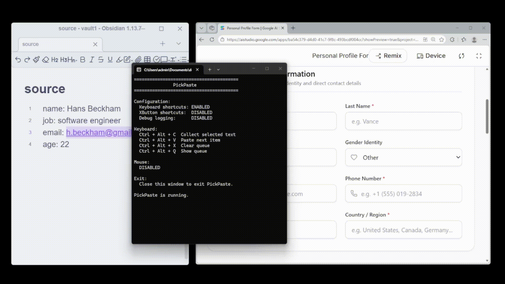

# 🚀 PickPaste — あなたの生産性ゲームチェンジャー

**ウィンドウ切り替えで時間を無駄にしない。1クリックで起動、完全にワークフローを変える。**

<video src="assets/a.mp4" width="100%" controls autoplay loop muted></video>



---

## 💭 私たちの哲学

> **私たちはあなたをより速く仕事させることではなく、あなたの集中力を保護することです。**

ほとんどのツールは表面的な速度の最適化を試みます。PickPasteは異なります。

私たちが保護するもの：**あなたの集中力、あなたのフロー状態、仕事を完了したときの満足感。**

これは単なる時間節約ではありません。**これはあなたの職業生活で最も価値のあるもの、つまりあなたの注意力を保護することです。**

---

## ⚡ 問題 → 解決策 → 結果

### 問題

毎日、何百万もの労働者が同じサイクルを繰り返します：

**情報を探す → ウィンドウを切る → 情報を入力する → また切る → 50回繰り返す...**

研究によれば、**ウィンドウを1回切り替えるには15～25秒かかります**。10分に見えるタスクは実際には25分かかります——15分は切り替えで無駄になります。あなたの注意力は粉々になります。

### 私たちの解決策

```
❌ 伝統的：探す→切→入力 | 探す→切→入力 | 探す→切→入力  [破壊されたワークフロー]
✅ PickPaste：探す→探す→探す | 1回切る | 入力→入力→入力  [連続したフロー]
```

**コアロジック**：すべての情報を最初に収集し、次にすべての作業を完了します。中断なし。

### 結果

| メトリック | 伝統的 | PickPaste |
|-----------|-------|----------|
| 10個のデータ入力完了 | 20分以上 | 3～4分 |
| ウィンドウ切り替え | 20回以上 | 1回 |
| 集中力回復の瞬間 | 15回以上 | 0回 |
| 仕事の満足度 | 😫 疲れた | 😎 スムーズ |

---

## 💡 これができることは

### 💪 効率が200%以上向上
単なる速度ではなく、**フロー状態を保護する**。仕事がより連続的でスムーズになります。

### 🧠 認知負荷が大幅に低下
「どこにいるのか」と「次は何か」と自問自答する必要がなくなります。現在のタスクに集中するだけです。

### 💨 学習コストゼロ
インストールしてすぐに使えます。複雑なUIなし、急な学習曲線なし。

### ⚡ 真の軽量性
メモリ使用量 <10MB、完全にオフライン、ゼロトラッキング。

### 🎯 ミニマリスト哲学
1つのことを完璧にこなします。臃肿した「クリップボード管理ツール」ではありません。

---

## 👥 これを好む人 & 実際の支援

### 営業/オペレーション — 複数のソースから情報を抽出
**伝統的**：メールを見る → コピー → スプレッドシートを開く → 貼り付け → メールに戻る（50回以上繰り返す）  
**PickPaste**：すべてのメールを見てコピー → スプレッドシートに切る → 連続貼り付け ✨

### 編集者/ジャーナリスト — マルチソースリサーチを整理
**伝統的**：ウェブで調査 → 文書に書く → 再び調査 → 戻す…… ワークフロー破壊  
**PickPaste**：すべての資料を最初に収集 → 文書に切る → 中断なく書く ✨

### 開発者 — エラーメッセージ、コードスニペット、パラメータを収集
**伝統的**：ログをチェック → コピー → エディタに貼り付け → ログに戻る…… 常に切り替え  
**PickPaste**：複数のソースからすべての情報を収集 → コードに切る → 一度に使用 ✨

### データアナリスト — 複数のレポートからデータを抽出
15分のウィンドウ切り替えから10分の集中時間を節約します。

### その他のシナリオ
- フォーム入力（ウェブページフィールド → スプレッドシート）
- Excel データ入力（音楽を聴きながら作業）
- コンテンツキュレーション（PDF、メール、チャット → 文書）
- ウィンドウ間でテキストを移動するすべてのジョブ

---

## 🚀 クイックスタート & インストール & 設定

### ⚡ 30秒起動

1. **ダウンロード** [`PickPaste.exe`](bin/PickPaste.exe)
2. **ダブルクリックして実行**
3. **完了** — すぐに使用可能

インストールなし、設定なし、再起動なし。

### 🎮 ホットキー

| ショートカット | 機能 |
|--------------|------|
| `Ctrl + Alt + C` | 現在のクリップボードを収集 |
| `Ctrl + Alt + V` | 次の項目を貼り付け |
| `Ctrl + Alt + X` | キューをクリア |
| `Ctrl + Alt + Q` | キューのステータスを表示 |

マウスサイドボタン（XButton1/XButton2）でも同じアクションをサポートします。

### ⚙️ カスタム設定（オプション）

`config.ini` を編集してください：

```ini
[Hotkeys]
EnableKeyboard=true    # キーボードショートカット
EnableXButton=true     # マウスサイドボタン
```

保存すると変更が即座に反映されます。再起動は不要です。

### 📋 システム要件

| 項目 | 要件 |
|------|------|
| **OS** | Windows 10 / Windows 11 |
| **PowerShell** | 5.0以上（Windows組み込み） |
| **権限** | 標準ユーザー権限 |
| **メモリ** | <10 MB |
| **ディスク** | <2 MB |

**要するに**：Windows 10以降をお持ちですか？PickPasteが動作します。完全にゼロ依存。

---

## これは何ではありません

- ❌ 「クリップボード履歴マネージャー」ではありません — それらのツールはすべてを保存しようとし、複雑になります
- ❌ 「クラウド協調ツール」ではありません — ローカル効率に焦点を当てます
- ❌ 「重量級アプリ」ではありません — あなたがそれを必要とするまで、その存在に気づきません

**これです**：レーザーでフォーカスされた効率ツール。1つの仕事、完璧に実行されます。

---

## よくある質問

**Q: 管理者権限が必要ですか？**  
A: いいえ。標準ユーザー権限で十分です。

**Q: データをアップロードしますか？**  
A: 完全にオフライン。ゼロクラウド、ゼロ追跡。

**Q: 多くのリソースを消費しますか？**  
A: あなたは気づきません。10MB未満のメモリ。

**Q: Mac/Linuxをサポートしていますか？**  
A: 現在はWindowsのみ。将来的には可能性があります。

**Q: どのくらい使用できますか？**  
A: 永遠に。MITライセンス、完全に無料です。

---

## 私たちの哲学

> **私たちの目標は、あなたをより速く仕事させることではなく、あなたの仕事が中断されないようにすることです。**

ほとんどのツールは表面的な速度の最適化を試みます。PickPasteは異なります。

深い部分を最適化します — あなたの集中力、あなたのフロー状態、仕事を完了したときの満足感。

**これは単なる時間節約ではありません。それはあなたの職業生活で最も価値のあるもの、つまりあなたの注意力を保護することです。**

---

## ロードマップ

「1つの仕事」の哲学に厳密に従っています。今後の予定：

- 📊 キュー可視化（収集した内容を表示）
- 🎮 より多くのカスタムホットキーオプション
- 🪟 複数ウィンドウプロファイル
- 📋 クリップボード形式保持の向上

すべての新機能は自問自答します：**これはコンテキスト切り替えを減らしますか？**

答えが「いいえ」なら、私たちは構築しません。

---

## ダウンロード & 開始

👉 **[PickPaste.exeをダウンロード](bin/PickPaste.exe)**

ダブルクリックして、生産性の革命を始めてください。

インストール不要。設定不要。再起動不要。

---

## プロジェクトをサポート

- ⭐ このツールがあなたのワークフローを変えたら、Starをつけてください
- 🤝 ウィンドウ切り替けの地獄に陥っている同僚と共有してください
- 💬 あなたのストーリーを教えてください — 実例は他の人の決定を助けます

---

## ライセンス

MIT License — [LICENSEファイルを参照](LICENSE)

自由に使用、修正、共有できます。

